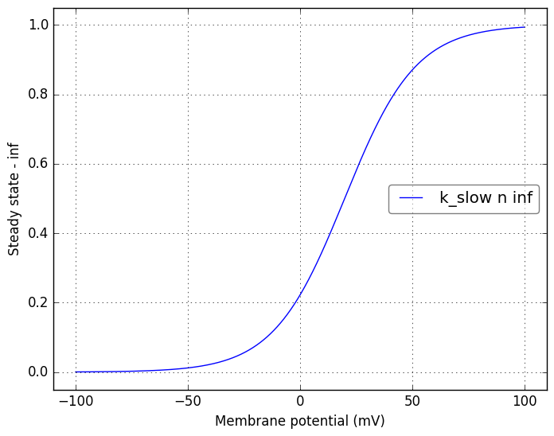
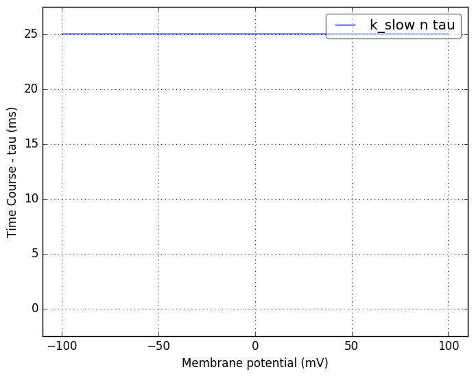
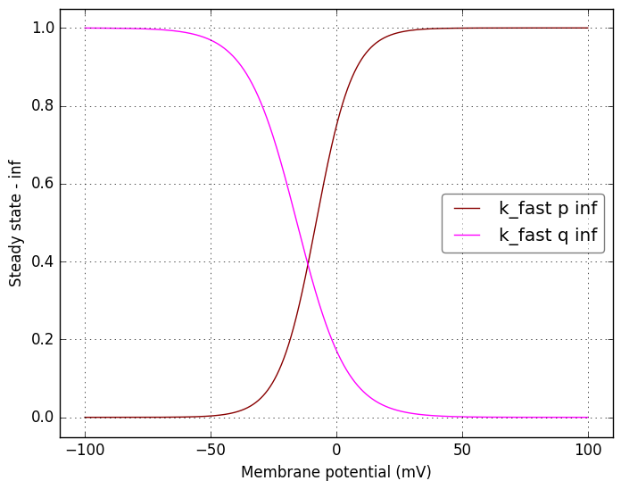
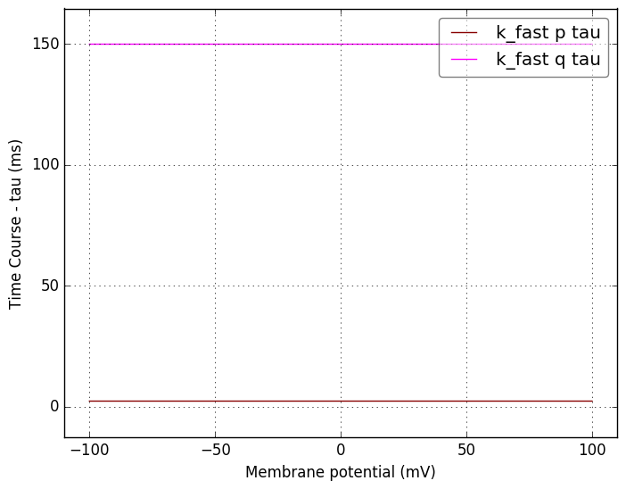
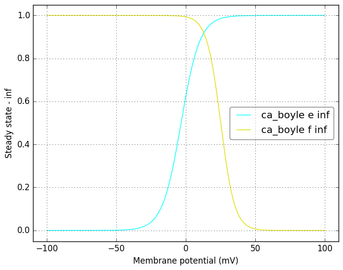
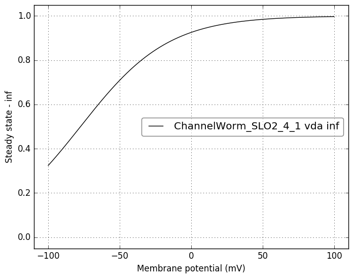
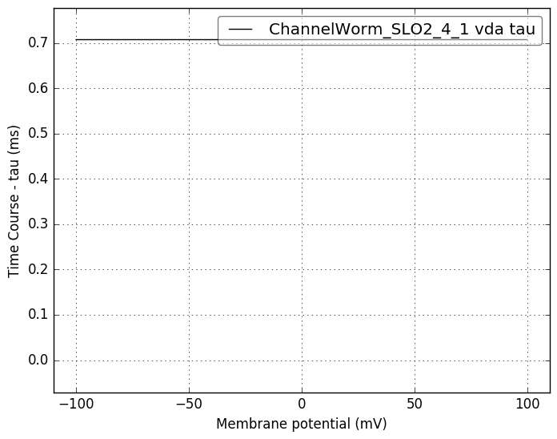

Channel information
===================
    

Channel information at: T = 34.0 degC, E_rev = 50.0 mV, [Ca2+] = 0.001 mM

<table>
    <tr>
<td width="120px">
            <b>k_slow</b> 
            <a href="../SHK-1.channel.nml">SHK-1.channel.nml</a> 
            <b>Ion: k</b> 
            <i>g = gmax * n </i> 
            K slow channel from Boyle and Cohen 2008
</td>
<td>

</td>
<td>

</td>
</tr>
    <tr>
<td width="120px">
            <b>k_fast</b> 
            <a href="../SHL-1.channel.nml">SHL-1.channel.nml</a> 
            <b>Ion: k</b> 
            <i>g = gmax * p4 * q </i> 
            K fast channel from Boyle and Cohen 2008
</td>
<td>

</td>
<td>

</td>
</tr>
    <tr>
<td width="120px">
            <b>ca_boyle</b> 
            <a href="../EGL-19.channel.nml">EGL-19.channel.nml</a> 
            <b>Ion: ca</b> 
            <i>g = gmax * e2 * f </i> 
            Ca channel from Boyle and Cohen 2008
</td>
<td>

</td>
<td>

</td>
</tr>
    <tr>
<td width="120px">
            <b>ChannelWorm_SLO2_4_1</b> 
            <a href="../SLO-2.channel.nml">SLO-2.channel.nml</a> 
            <b>Ion: K</b> 
            <i>g = gmax * vda </i> 
            ${channel.notes}
</td>
<td>

</td>
<td>

</td>
</tr>
</table>

